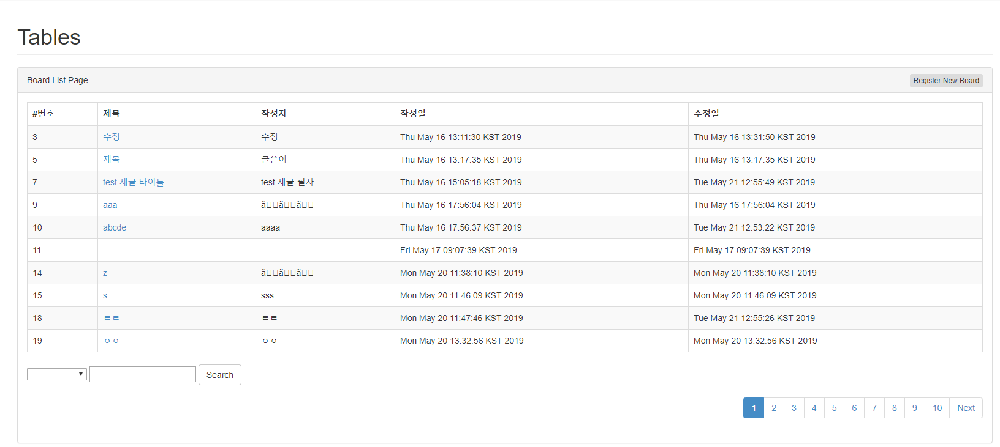
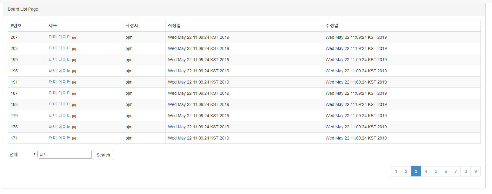
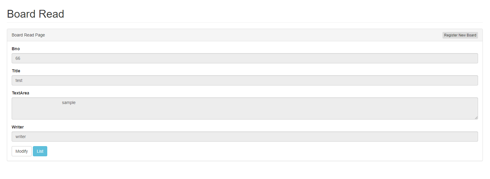
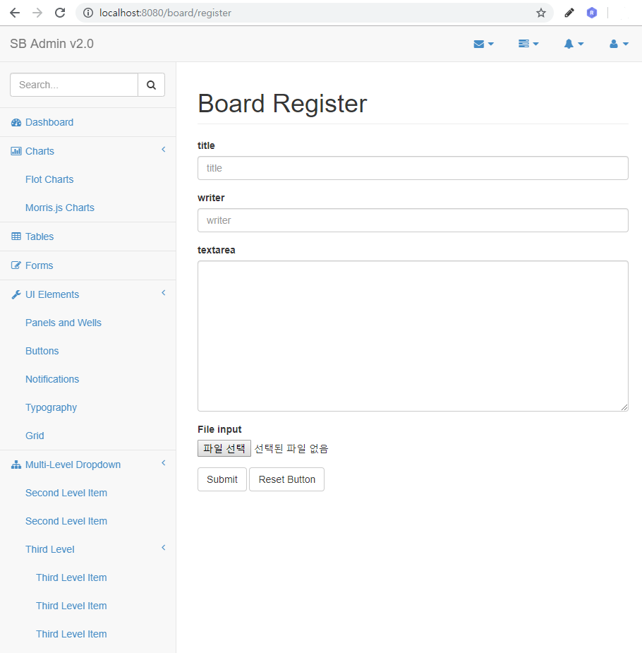

# 게시판

## simple board

1. [개요](#개요)
1. [기본 기능](#기본-기능)
1. [테이블](#테이블)
1. [domain](#domain)
1. [mapper](#Mapper)
1. [Service](#Service)
1. [Controller](#Controller)
1. [view](#view)

### 개요

Spring MVC 기반의 게시판.
코드로 배우는 스프링 웹 프로젝트를 보고 만들었으며 지금 말하는 것은 회원가입없는 간단한 게시판

### 기본 기능

- 접속시 테이블에 저장된 게시판 글 목록이 페이징 처리되어 화면에 보여짐
- 글혹은 사용자 이름 등으로 검색가능
- 글 작성시 사용자 이름도 입력, 글을 적은 날짜를 DB에 저장하고 수정시 수정 날짜역시 DB에 저장
- 글쓰기, 수정, 삭제 관련 권한은 따로 나눠져있지 않고 누구나 글번호와 날짜와 글쓴이를 제외하고는 누구나 수정이 가능하며 삭제도 가능


### 테이블
- create 쿼리
```sql
CREATE TABLE `tbl_board` (
	`bno` INT(11) NOT NULL AUTO_INCREMENT,
	`title` VARCHAR(200) NOT NULL COLLATE 'utf8_bin',
	`content` VARCHAR(2000) NOT NULL COLLATE 'utf8_bin',
	`writer` VARCHAR(50) NOT NULL COLLATE 'utf8_bin',
	`regdate` DATETIME NOT NULL DEFAULT CURRENT_TIMESTAMP,
	`updateDate` DATETIME NOT NULL DEFAULT CURRENT_TIMESTAMP,
	`replyCnt` INT(11) NOT NULL DEFAULT '0',
	PRIMARY KEY (`bno`)
)
COLLATE='utf8_bin'
ENGINE=InnoDB
AUTO_INCREMENT=0
;
```
- bno는 각 데이터의 고유번호로 primary key, title는 글 제목 

### domain

- VO 클래스(tbl_board의 자료를 담기위한 클래스)
```java
import java.util.Date;
import lombok.Data;

@Data
public class BoardVO {

	private Long bno;
	private String title;
	private String content;
	private String writer;
	private Date regdate;
	private Date updateDate;
	private int replyCnt;
}

```
- 페이징&검색 기능
   1. Criteria 클래스:
   
   시작위치(pageNum)와 가져올 개수(amount) 그리고 검색시 검색 옵션(type)과 검색내용(keyword)를 저장하는 클래스.
   로직 구조가 oracle에 맞춰졌기에 service에서 한번 정제후 mapper로 보냄.
   모든 데이터를 보낸후 시각적으로 페이징 하는 것이 아닌 페이지에 할당된 데이터만 보냄.
   검색옵션의 경우 BoardMapper.xml 에서 확인하여 해당 검색옵션과 키워드에 맞는 데이터만 가져옴.
   차후 만들 다른 기능에도 사용예정.
   
   2. PageDTO 클래스 :
   아래쪽에 페이징 버튼을 위한 클래스.
   다음 버튼 페이지가 있는지 확인하는 prev, next 라는 boolean변수와 
   시작페이지, 끝페이지를 저장하는 int 변수(startPage,endPage) 그리고 현재 위치한
   페이지의 정보가 담긴 Criteria cri변수로 이뤄져 있다. 
   
   > 소스코드
```java
import lombok.Getter;
import lombok.Setter;
import lombok.ToString;

@Setter
@Getter
@ToString
public class Criteria {
	private int pageNum;
	private int amount;
	
	private String type;
	private String keyword;
	public Criteria(int pageNum, int amount) {
		super();
		this.pageNum = pageNum;
		this.amount = amount;
	}
	public Criteria(int pageNum, int amount,String type, String keyword) {
		super();
		this.pageNum = pageNum;
		this.amount = amount;
		this.type   = type;
		this.keyword = keyword;
	}
	public Criteria() {
		this(1,10);
	}
	
	public String[] getTypeArr() {
		return type == null? new String[]{}: type.split("");
	}
	
}
```

```java
import lombok.Data;

@Data
public class PageDTO {

	private int startPage;
	private int endPage;
	private boolean prev, next;
	
	private int total;
	private Criteria cri;
	
	public PageDTO(int total, Criteria cri) {
		super();
		this.total = total;
		this.cri = cri;
		
		this.endPage = (int)(Math.ceil(cri.getPageNum()/10.0))*10;
		this.startPage = endPage - 9;
		
		int realEnd = (int)(Math.ceil(total*1.0))/cri.getAmount()+(total%10==0?0:1);
		
		if(realEnd < this.endPage) {
			this.endPage = realEnd;
		}
		this.prev = this.startPage>1;
		this.next = this.endPage  <realEnd;
	}
	
	
	
}
```

### Mapper

- 모든 리스트를 가져오는 메소드, 페이징을 적용시킨 메소드, 데이터 추가, 삭제, 검색시 데이터 수를 가져오는 메소드로 구성되어 있다.
- 추후 댓글 추가후엔 댓글 개수를 업데이트 하는 메소드도 추가예정
- 해당 xml파일은 src/main/resource 에 BoardMapper.java의 레포지토리와 동일한 구조의 폴더를 만든후 생성
- service에서 mapper를 호출하여 사용시 @Setter(onMethod_ = @Autowired)로 자동으로 

- 소스코드
 + BoardMapper.java
```java
import java.util.List;

import org.apache.ibatis.annotations.Param;
import org.zerock.domain.BoardVO;
import org.zerock.domain.Criteria;

public interface BoardMapper {

	public List<BoardVO> getList();
	public List<BoardVO> getListWithPaging(Criteria cri);
	public void insert(BoardVO board);
	public BoardVO read(Long bno);
	public int delete(long bno);
	public int update(BoardVO board);
	public int count();
	public int searchCount(Criteria cri);
	public void updateReplyCnt(@Param("bno")Long bno, @Param("amount") int amount);
}
```
 + BoardMapper.xml
```xml
<!--mapper태그 내부 내용-->
	<select id="getList" resultType="org.zerock.domain.BoardVO">
		<![CDATA[
		SELECT * FROM tbl_board WHERE bno > 0 ORDER BY bno DESC
		
		]]>
	</select>
	
	<insert id="insert">
		INSERT INTO tbl_board (title, content, writer) VALUES(#{title},#{content},#{writer})
	</insert>
	
	<select id="read" resultType="org.zerock.domain.BoardVO">
		SELECT * FROM tbl_board WHERE bno =#{bno} 
	</select>
	
	<delete id="delete">
		DELETE FROM tbl_board WHERE bno =#{bno}
	</delete>
	
	<update id="update">
		
		UPDATE tbl_board SET 
		title = #{title}, content = #{content},writer = #{writer},
		updatedate = CURRENT_TIMESTAMP 
		WHERE bno =#{bno};
	
	</update>
	
	<select id="count" resultType="int">
	<![CDATA[
	SELECT COUNT(*) FROM tbl_board WHERE bno>0
		]]>
	</select>
	
	<select id="getListWithPaging" resultType="org.zerock.domain.BoardVO">
		<![CDATA[
		SELECT * FROM tbl_board WHERE
		]]>

 			<include refid="criteria"></include>

 		<![CDATA[bno>0]]>
 		ORDER BY bno DESC
		LIMIT #{pageNum} , #{amount}
	</select>
	
	<select id="searchCount" resultType="int">
	
		<![CDATA[
		SELECT COUNT(*) FROM tbl_board WHERE
		]]>

 			<include refid="criteria"></include>

 		<![CDATA[bno>0]]>
	
	</select>
	
	<update id="updateReplyCnt">
		
		UPDATE tbl_board SET replyCnt=replyCnt+#{amount} 
		WHERE bno = #{bno}
	
	</update>
	
	<sql id ="criteria">
 		<trim prefix="(" suffix=") AND" prefixOverrides="OR">
 		   <foreach item="type" collection="typeArr">
 			<trim prefix="OR">
 			  <choose>
 			     <when test="type=='T'.toString()">title   like CONCAT('%',#{keyword},'%')</when>
			     <when test="type=='C'.toString()">content like CONCAT('%',#{keyword},'%')</when>
			     <when test="type=='W'.toString()">writer  like CONCAT('%',#{keyword},'%')</when>
			  </choose>			
 			</trim>
 		     </foreach>
 		</trim>
 	</sql>
	
```
### Service
- BoardService 인터페이스와 BoardServiceImpl 클래스로 나눠져있으며 후자가 전자를 상속받는다.
- mapper를 사용할때와 마찬가지로 @Setter(onMethod_ = @Autowired) 로 의존성 주입후 사용.
- 다른 기능들은 그대로 mapper에 연결하면 되나, paging의 경우 앞서 말했듯이 로직이 바뀌어야함
  + oracle의 경우 pageNum이 이름대로 몇페이지인지를 알려주는 역할이지만 이 프로젝트에서는 mysql의 LIMIT를 사용하므로 별도의 처리가 필요
  + pageNum이 페이징이 시작될 rownum의 값을 지칭하는 역할이 되었으므로, pageNum 대신 amount * (pageNum-1)이 들어가야함
   ```java
  	@Override
	public List<BoardVO> getList(Criteria cri) {
		// TODO Auto-generated method stub
		
		Criteria temp = new Criteria(cri.getAmount()*(cri.getPageNum()-1), cri.getAmount(),cri.getType(),cri.getKeyword());
		
		return mapper.getListWithPaging(temp);
	}
  ```
- 메소드들의 연결은 다음과 같음

  |mapper|service|기능|
  |---|---|---|
  |void regiter(BoardVO board)|void insert(BoardVO board)|새로운 글 |
  |BoardVO get(Long bno)|BoardVO read(Long bno)|bno로 에 해당하는 글 정보 가져오기|
  |int update(BoardVO board)|boolean modify(BoardVO board)|board의 bno에 해당하는 글 board의 정보로 업데이트|
  |int delete(long bno)|boolean remove(Long bno)|bno에 해당하는 글 삭제|
  |List<BoardVO> getList()|List<BoardVO> getList()|모든 리스트|
  |List<BoardVO> getListWithPaging(Criteria cri)|List<BoardVO> getList(Criteria cri)|페이징 적용후 리스트|
  |int count()|int count()|모든 카운트|
  |int searchCount(Criteria cri)|int count(Criteria cri)|페이징 사용시 카운트|
	
  
### controller
- RequestMapping 대신 GetMapping,PostMapping 사용
- board/뒤에 list, regiter, modify, remove 를 넣어 이동되도록 설정.
- view 에 값을 보낼땐 Model을 쓰며 , 후에 결과에 따라 modal 창으로 원하는 메세지를 보이게 하기 위해 reult라는 string에 어떤 메소드가
동작했는지 기입하여 추가.
```java

import javax.servlet.http.HttpServletRequest;

import org.springframework.beans.factory.annotation.Autowired;
import org.springframework.stereotype.Controller;
import org.springframework.ui.Model;
import org.springframework.web.bind.annotation.GetMapping;
import org.springframework.web.bind.annotation.ModelAttribute;
import org.springframework.web.bind.annotation.PostMapping;
import org.springframework.web.bind.annotation.RequestMapping;
import org.springframework.web.bind.annotation.RequestParam;
import org.springframework.web.servlet.mvc.support.RedirectAttributes;
import org.zerock.domain.BoardVO;
import org.zerock.domain.Criteria;
import org.zerock.domain.PageDTO;
import org.zerock.service.BoardService;

import lombok.Setter;
import lombok.extern.log4j.Log4j;

@Log4j //실제 소스에선 log를 많이 찍어봄
@Controller
@RequestMapping("/board/*")// /board/뒤에 해당 매핑이 올거란것

public class BoardController {

	@Setter(onMethod_ = { @Autowired })
	BoardService service;

	@GetMapping("/list")
	public void list(Criteria cri, HttpServletRequest request, Model model) {
		model.addAttribute("list", service.getList(cri));
		model.addAttribute("pageMaker", new PageDTO(service.count(), cri));
	}

	@GetMapping("/register")
	public void register() {}

	@PostMapping("/register")
	public String register(BoardVO board, RedirectAttributes rttr) {
		service.register(board);
		rttr.addFlashAttribute("result", "register");
		return "redirect:/board/list";
	}

	@GetMapping({ "/get", "/modify" })
	public void get(@RequestParam("bno") Long bno, Model model) {
		model.addAttribute("board", service.get(bno));
	}

	@PostMapping("/modify")
	public String modify(BoardVO board, @ModelAttribute("cri") Criteria cri, RedirectAttributes rttr) {
		if (service.modify(board)) {
			rttr.addFlashAttribute("result", "modify");
		}

		rttr.addAttribute("pageNum", cri.getPageNum());
		rttr.addAttribute("amount", cri.getAmount());
		rttr.addAttribute("type", cri.getType());
		rttr.addAttribute("keyword", cri.getKeyword());

		return "redirect:/board/list";
	}

	@PostMapping("/remove")
	public String remove(@RequestParam("bno") Long bno, Criteria cri, RedirectAttributes rttr) {
		if (service.remove(bno)) {
			rttr.addFlashAttribute("result", "remove");
		}
		rttr.addAttribute("pageNum", cri.getPageNum());
		rttr.addAttribute("amount", cri.getAmount());
		rttr.addAttribute("type", cri.getType());
		rttr.addAttribute("keyword", cri.getKeyword());

		return "redirect:/board/list";
	}

}


```
### view

- sb-admin-v2 라는 부트스트랩 테마로 디자인.
- 당연히 모두 jsp 페이지로 만들어짐
- **board/list**
  + 검색& 페이징 결과 나온 데이터를 테이블로 뿌려 서 보여줌
  + 각 글의 타이틀을 클릭할시 해당 글의 read 페이지로 이동

> 아래는 검색시

- **board/read**
  + 읽는것만 가능하며 modfiy버튼을 눌러야 수정/삭제 기능 사용가능
  + list버튼은 직전에 본 board list의 검색옵션과 페이지 번호를 기억해서 다시 되돌려보내줌.

- **board/register**
 + 새로운 글을 작성하는 곳. read와 모양은 거의 같음.


