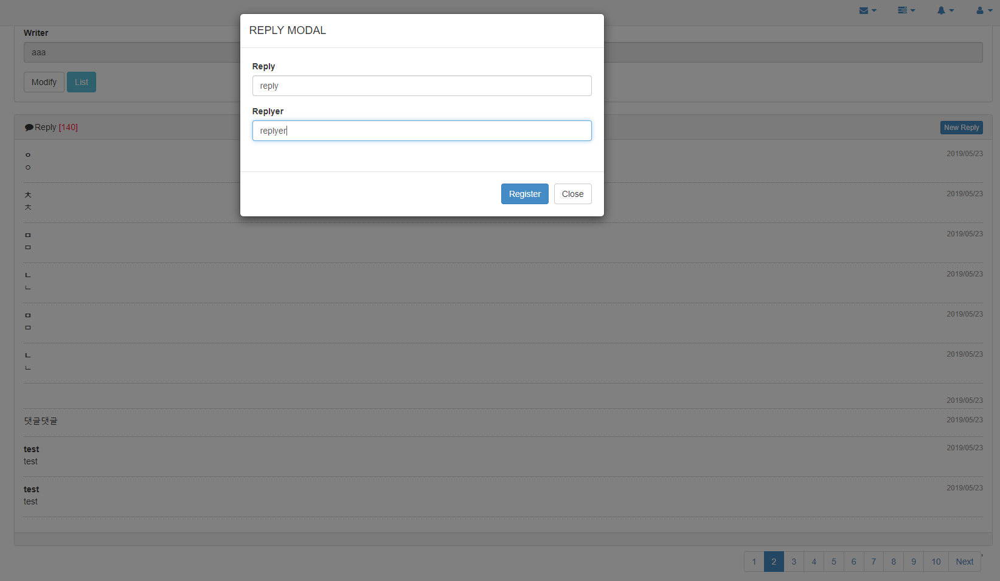
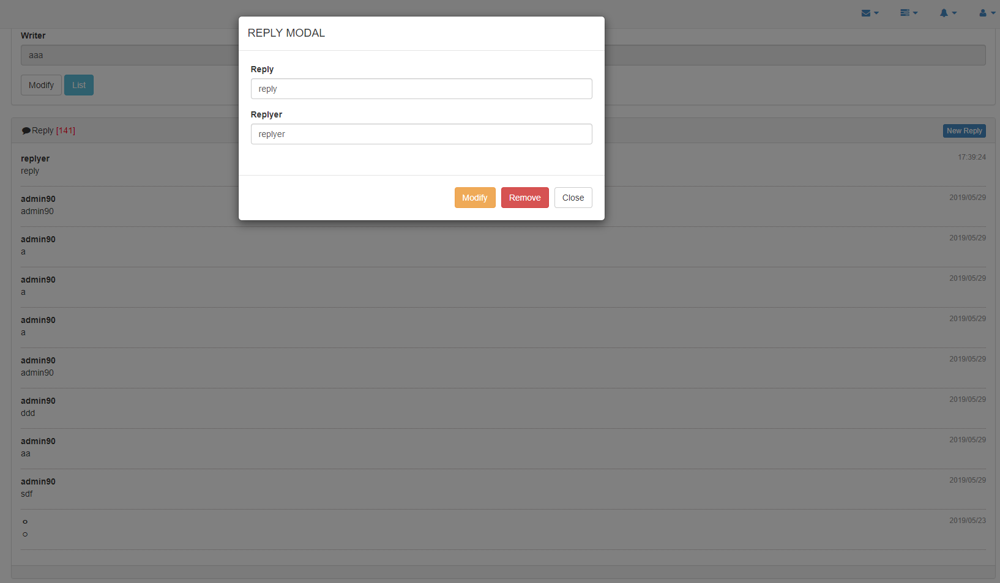

# 게시판

## reply

1. [기본 기능](#기본-기능)
1. [테이블](#테이블)
1. [domain](#domain)
1. [mapper](#Mapper)
1. [Service](#Service)
1. [Controller](#Controller)
1. [view](#view)

### 기본기능

- 게시판에 댓글달기 기능추가 및 ajax로 페이징

### 테이블

- 게시판 DB와 거의 동일한 구조.
- bno를 받아서 외래키로 사용.

```sql
CREATE TABLE `tbl_reply` (
	`rno` INT(10) NOT NULL AUTO_INCREMENT,
	`bno` INT(11) NOT NULL,
	`reply` VARCHAR(1000) NOT NULL COLLATE 'utf8_bin',
	`replyer` VARCHAR(50) NOT NULL COLLATE 'utf8_bin',
	`replyDate` DATETIME NULL DEFAULT CURRENT_TIMESTAMP,
	`updateDate` DATETIME NULL DEFAULT CURRENT_TIMESTAMP ON UPDATE CURRENT_TIMESTAMP,
	PRIMARY KEY (`rno`),
	INDEX `FK_tbl_reply_tbl_board` (`bno`),
	CONSTRAINT `FK_tbl_reply_tbl_board` FOREIGN KEY (`bno`) REFERENCES `tbl_board` (`bno`) ON UPDATE NO ACTION ON DELETE CASCADE
)
COLLATE='utf8_bin'
ENGINE=InnoDB
AUTO_INCREMENT=0
;
```
### domain
-  테이블과 동일구조
```java
package org.zerock.domain;

import java.util.Date;

import lombok.Data;

@Data
public class ReplyVO {
 
	private Long rno;
	private Long bno;
	
	private String reply;
	private String replyer;
	
	private Date replyDate;
	private Date updateDate;
}
```
### mapper
 - 역시 board와 비슷하나 좀더 간결함.
 ```java
 //ReplyMapper.java
 import java.util.List;

import org.apache.ibatis.annotations.Param;
import org.zerock.domain.Criteria;
import org.zerock.domain.ReplyVO;

public interface ReplyMapper {
	public int insert(ReplyVO vo);
	public ReplyVO read(Long rno);
	public int delete(Long rno);
	public int update(ReplyVO vo);
	public List<ReplyVO> getListWithPaging(
			@Param("cri") Criteria cri,
			@Param("bno") Long bno
			);
	public int getCountByBno(Long bno);
	
}
 ```
```xml
<!--ReplyMapper.xml-->
  <?xml version="1.0" encoding="UTF-8"?>
<!DOCTYPE mapper PUBLIC "-//mybatis.org//DTD Mapper 3.0//EN" "http://mybatis.org/dtd/mybatis-3-mapper.dtd">
<mapper namespace="org.zerock.mapper.ReplyMapper">
	
	<insert id="insert">
		INSERT INTO tbl_reply(bno, reply, replyer) VALUES (#{bno},#{reply},#{replyer})
	</insert>
	
	<select id = "read" resultType="org.zerock.domain.ReplyVO">
		SELECT * FROM  tbl_reply WHERE rno = #{rno}
	</select>
	
	<delete id="delete">
		DELETE FROM tbl_reply WHERE rno = #{rno}
	</delete>
	
	<update id="update">
		UPDATE tbl_reply SET reply = #{reply}, updatedate = CURRENT_TIMESTAMP  WHERE rno = #{rno}
	</update>
	
	<select id = "getListWithPaging" resultType="org.zerock.domain.ReplyVO">
		SELECT * FROM  tbl_reply WHERE bno = #{bno} ORDER BY rno DESC LIMIT #{cri.pageNum} , #{cri.amount}
	</select>
	<select id="getCountByBno" resultType="int">
		SELECT COUNT(*) FROM tbl_reply WHERE bno = #{bno} ORDER BY rno DESC
	</select>
</mapper>
```
- 또한 Board의 댓글수 설정을 위해 BoardMapper 인터페이스에 updateReplyCnt 메소드 추가후 xml에 다음과 같이 작성
```xml
	<update id="updateReplyCnt">
		
		UPDATE tbl_board SET replyCnt=replyCnt+#{amount} 
		WHERE bno = #{bno}
	
	</update>
```
### Service

- java단과 js단의 ReplyService가 따로있음(js단은 view에서)
- js는 ajax처리를 위한 영역
- 앞선 board와 mapper, service간의 매핑은 동일
- 또한 board에서 처럼 페이징시 아래와 같은 처리를 해줘야함.
```java
  public ReplyPageDTO getListPage(Criteria cri, Long bno) {
		// TODO Auto-generated method stub
		Criteria temp = new Criteria(cri.getAmount()*(cri.getPageNum()-1), cri.getAmount());
		return new ReplyPageDTO(
				mapper.getCountByBno(bno), 
				mapper.getListWithPaging(temp, bno));
	}

```
- 또한 댓글 삭제/추가시 해당 게시물의 댓글수 update반드시 실행
```java
	@Setter(onMethod_ = @Autowired)
	private ReplyMapper mapper;
	
	@Setter(onMethod_ = @Autowired)
	private BoardMapper boardMapper;
	
	
	@Override
	public int register(ReplyVO vo) {
		// TODO Auto-generated method stub
		boardMapper.updateReplyCnt(vo.getBno(),1);
		return mapper.insert(vo);
	}
  
  	@Override
	public int remove(Long rno) {
		// TODO Auto-generated method stub
		ReplyVO vo = mapper.read(rno);
		
		boardMapper.updateReplyCnt(vo.getBno(), -1);
		return mapper.delete(rno);
	}
```
### Controller

- RestController로 작성하며, 이경우는 reply.js와 ReplyService를 연결해주는 역할을 함
- DeleteMapping, PreAuthorize 등도 사용

```java

import org.springframework.beans.factory.annotation.Autowired;
import org.springframework.http.HttpStatus;
import org.springframework.http.MediaType;
import org.springframework.http.ResponseEntity;
import org.springframework.security.access.prepost.PreAuthorize;
import org.springframework.web.bind.annotation.DeleteMapping;
import org.springframework.web.bind.annotation.GetMapping;
import org.springframework.web.bind.annotation.PathVariable;
import org.springframework.web.bind.annotation.PostMapping;
import org.springframework.web.bind.annotation.RequestBody;
import org.springframework.web.bind.annotation.RequestMapping;
import org.springframework.web.bind.annotation.RequestMethod;
import org.springframework.web.bind.annotation.RestController;
import org.zerock.domain.Criteria;
import org.zerock.domain.ReplyPageDTO;
import org.zerock.domain.ReplyVO;
import org.zerock.service.ReplyService;

import lombok.Setter;
import lombok.extern.log4j.Log4j;

@Log4j
@RestController // restcon 으로 작성, restlet로 테스트
@RequestMapping("/replies/*")
public class ReplyController {  
 
	@Setter(onMethod_ = { @Autowired })
	private ReplyService service;
	
	@PreAuthorize("isAuthenticated()")
	@PostMapping(value = "/new", consumes = "application/json", produces = { MediaType.TEXT_PLAIN_VALUE })
	public ResponseEntity<String> create(@RequestBody ReplyVO vo) {
		log.info("rVO:" + vo);
		int insertCount = service.register(vo);
		log.info("Ins cnt:" + insertCount);
		return insertCount == 1 ? new ResponseEntity<>("success", HttpStatus.OK)
				: new ResponseEntity<>("success", HttpStatus.INTERNAL_SERVER_ERROR);
	}

	@GetMapping(value = "/pages/{bno}/{page}", produces = { MediaType.APPLICATION_ATOM_XML_VALUE,
			MediaType.APPLICATION_JSON_UTF8_VALUE })
	public ResponseEntity<ReplyPageDTO> getList(@PathVariable("page") int page, @PathVariable("bno") Long bno) {
		 
		Criteria cri = new Criteria(page, 10);
		return new ResponseEntity<>(service.getListPage(cri, bno), HttpStatus.OK);
	
	}
	
	@GetMapping(value = "/{rno}", produces = {
	MediaType.APPLICATION_XML_VALUE, MediaType.APPLICATION_JSON_UTF8_VALUE		
	})
	public ResponseEntity<ReplyVO> get(@PathVariable("rno") Long rno){
		return new ResponseEntity<>(service.get(rno),HttpStatus.OK);
		}
	
	@PreAuthorize("principal.username == #vo.replyer")
	@DeleteMapping(value="/{rno}",produces = {MediaType.TEXT_PLAIN_VALUE})
	public ResponseEntity<String> remove(@PathVariable("rno") Long rno){
	return service.remove(rno) == 1 ? new ResponseEntity<>("success", HttpStatus.OK)
			: new ResponseEntity<>("success", HttpStatus.INTERNAL_SERVER_ERROR);	
	}
	@PreAuthorize("principal.username == #vo.replyer")
	@RequestMapping(method = {RequestMethod.PUT,RequestMethod.PATCH}, value = "/{rno}",
	consumes = "application/json", produces = {MediaType.TEXT_PLAIN_VALUE})
	public ResponseEntity<String> modify(@RequestBody ReplyVO vo, @PathVariable("rno")Long rno){
		return service.modify(vo)==1? new ResponseEntity<>("success", HttpStatus.OK)
				: new ResponseEntity<>("success", HttpStatus.INTERNAL_SERVER_ERROR);
	}
	
}

```

### view

- board/get페이지에서 댓글을 보여주며 모든 기능은 ajax로 처리
- reply.js에서 ajax통신으로 기능 실행
- 댓글 작성, 수정, 삭제 모두 Modal창에서 이루어짐
- 작성한 댓글을 클릭시 수정 삭제 관련 modal 창이 뜸




 
