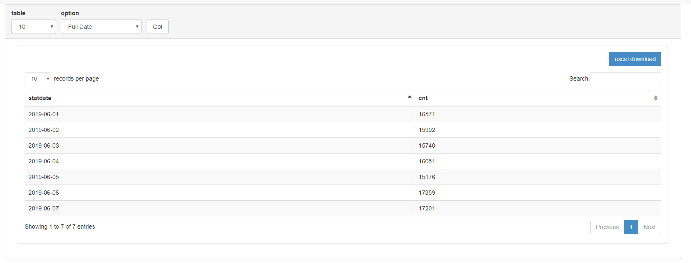
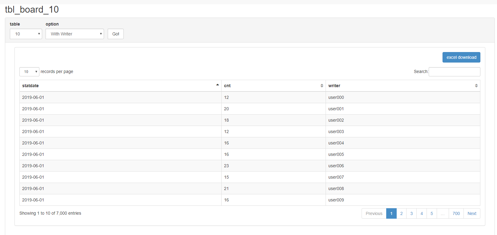
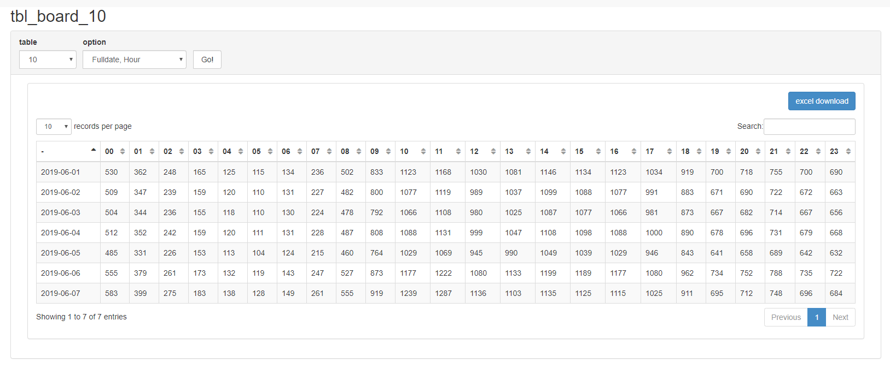

# 통계화면

### domain

- 앞서 만든 3개의 테이블의 통계 조건을 저장하는 TableDTO 클래스 생성

```java
import java.util.HashMap;
import java.util.List;

import org.zerock.service.sta.StaService;

import lombok.Data;

@Data
public class TableDTO {
	
	private final String [] types = {"%Y-%m-%d","%H","%a","%U","%u","%d-%H","%w","%d"};
	public static final int YMD = 0,H = 1,A=2,U_l=3,U_s=4,D_H=5,W=6,D=7;
  //date_format타입을 쉽게 변경하기 위한 것들
	public HashMap<String, List <String>> colList;
	
	public TableDTO(String tableName,int type1,int type2) {
		super();
		this.tableName = tableName;
		try {
			SetFormatType(type1);
			SetFormatType2(type2);
			
		} catch (Exception e) {
		}
	}
	public TableDTO(String tableName,int type) {
		super();
		this.tableName = tableName;
		try {
			SetFormatType(type);
		} catch (Exception e) {
			this.formatType = types[YMD];			
		}
	}
	public TableDTO(String tableName) {
		super();
		this.tableName = tableName;
		setFormatColumn(types[YMD]);
	}
	
	public TableDTO() {
		super();
		this.tableName = StaService.BOARD_10;
		this.formatType = types[YMD];		
	}
  
	//기본은 10만개짜리 테이블, 날짜 풀로 가져옴
  //constructor에서 설정가능
  
	public void SetFormatType(int type) {
		this.formatType = types[type];
		this.formatColumn = "stat" + (type==H?"hour":"date");
	}
	
	public void SetFormatType2(int type) {
		this.formatType2   = types[type];
		this.formatColumn2 = "stat" + (type==H?"hour":"date");
	}
	//format를 쉽게 바꾸고 오타를 줄이기 위한 customSetter
	private String tableName;
	private String formatType;
	private String formatType2;// 날짜, 시간을 모두 가져와야할때 외엔 안쓰임
	
	
	private String formatColumn="statdate";
	private String formatColumn2="statdate";
	private boolean write=false;//글쓴이도 가져올지 묻는 변수

}

```

### mapper

- tableDTO를 파라미터로 받아 테이블 이름, 옵션 등에 따른 정보를 가져옴

```java

	public List<?> getStatistic(@Param("table") TableDTO table);
	public List<?> getStatisticMulti(@Param("table") TableDTO table);

```
```xml
<select id="getStatistic" resultType="map">
SELECT DATE_FORMAT(regdate, #{table.formatType}) AS ${table.formatColumn} ,COUNT(*) AS cnt 

<if test="table.write">
,writer
</if>
FROM ${table.tableName} GROUP BY DATE_FORMAT (regdate, #{table.formatType})
<if test="table.write">
,writer
</if>

</select>


<select id="getStatisticMulti" resultType="map">
SELECT DATE_FORMAT(regdate, #{table.formatType}) AS ${table.formatColumn}
,DATE_FORMAT(regdate, #{table.formatType2}) AS ${table.formatColumn2}
 ,COUNT(*) AS cnt FROM ${table.tableName} GROUP BY 
 DATE_FORMAT (regdate, #{table.formatType}),DATE_FORMAT(regdate, #{table.formatType2})

</select>

```

### Service&Controller

- 서비스에서 getSta..와 멀티를 하나로 묶어서 boolean을 파라미터로 받아서 true면 가로 세로 표로 전환하여 보낼 수 있게
multi false면 그냥 getStatistic으로 보내게 작성
- 컨트롤러에선 그대로 게시판처럼 뿌려줌.
-writer가 들어갈경우 데이터가 많아지므로 dataTable로 시각적으로만 페이징






